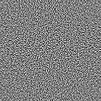
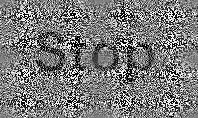

# Contributions 
This project was one of the first things i coded in Golang. It doesn't follow Go community guidelines and conventions. I plan on fixing it, but didn't have much time recently. Feel free to contribute if this is interesting !
# visual-cryptography
Visual Cryptography is a cryptographic technique which allows visual image to be encrypted in such a way that the decrypted information is a visual image. One of the best-known schemes is by Adi Shamir & Moni Naor developed 1994. ![[paper]](https://link.springer.com/content/pdf/10.1007/BFb0053419.pdf) <br>
visual cryptography is easy to decode, implement and requires no cryptographic computations. It can be used for secret sharing, In which an  image is broken into n shares and only someone with all the n shares is able to decrypt the image. The method can be extended to allow k out of n shares to be enough for the secret to be revealed.<br>
Here I implemented n out of n scheme for small values of n. To understand how everything works, I recommend reading the original paper. Alternatively you can read [this](https://datagenetics.com/blog/november32013/index.html) blog post by Nick Berry. There are also comments and implementation notes in the source code.

# Usage
You can run the code using binaries at /bin. Alternatively you can use run the source code in /src.
use argument below followed by image addresses. Note that multi-mode takes three images as input whereas
single-mode takes only one. Images must be encoded in png.

```
./main -help 
Usage of ./main:
  -multi-mode
      wether to use multi package to encrypt (default false) 
  -n int 
      number of transparencies, can't be used with multi-mode on (default 2)
```

``` 
./main -n 2 ../assets/example_2_2/dino.png
```

# Examples
<br>
<p align="center">
   
   
   
  <br>
  Example of 2-out-of-2 case. The first two images are transparencies. Last image is constructed by stacking the first two images.
  <br><br>
</p>

<p align="center">
   
  
   
   <br>
  Example of 4-out-of-4 case. Top-left is a single transparency. Top-right is an image of two transparencies stacked. Bottom-left shows three stacked trasparencies. Only the last image reveals the secret.
  <br>
  <br>
</p>

<p align="center">
   
   
   <br>
  Example of multi package. The first two transparencies are misleading. The secret is revealed by stacking the first two resulting in the third image.
</p>
